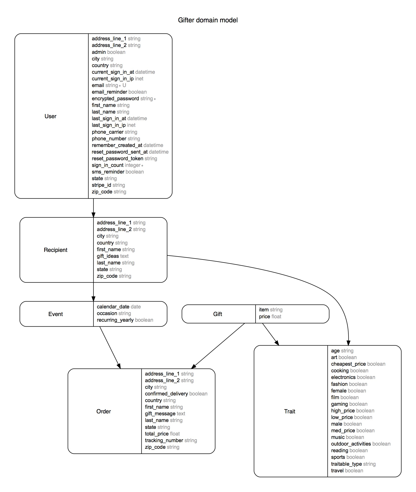

# Gifter

Gifter is an event scheduling and gift recommendation app. It helps you keep track of the important people in your life, and makes finding the right gift for that one special person a breeze. Simply create a profile for a recipient, and then Gifter will recommend items to send their way when an occasion comes up!

## Deployment
This app is deployed on Heroku. [Check it out!](https://stark-anchorage-54987.herokuapp.com/)


## Build
This app uses Ruby on Rails 5.0.1. It utilizes Devise for auth and Stripe to handle payments.

#### Full list of technologies
* Ruby on Rails
* PostgreSQL
* Javascript/jQuery
* Materialize
* Sass
* HTML
* CSS

## Database Structure

Polymorphic relationship for Traits with Gifts and Orders

## Challenges
* Modifying multiple models within one view
* Matching gifts to recipients based on their shared traits
```Ruby
def getRecommendations recipient
  rec_traits = recipient.traits.map(&:attributes).first
  matches = {}
  Gift.all.each do |gift|
    count = 0
    gift_traits = gift.traits.map(&:attributes).first
    gift_traits.each do |key, value|
      if rec_traits[key] == value
        count += 1
      end
    end
    matches[gift.id] = count
  end
  top_gifts = matches.sort_by{|k,v| -v}[0..10].to_h

  gift_ids = []
  top_gifts.each do |k,v|
    gift_ids << k
  end
  @gift_recs = Gift.find(gift_ids)
end
```

## Future Development
* Set up Twilio with Heroku Scheduler to automatically send reminders when it is time to choose a gift
* Calculate actual shipping costs
* Connect to the USPS API to deliver real time tracking information
* Conduct a regression analysis on trait data to more accurately predict the match percentage between a recipient and a gift
* Allow users to choose multiple gifts per event

##### Database Reconstruction
- Create Trait table out of all possible combinations of each trait, and then assign the corresponding trait combo id to each person/gift
